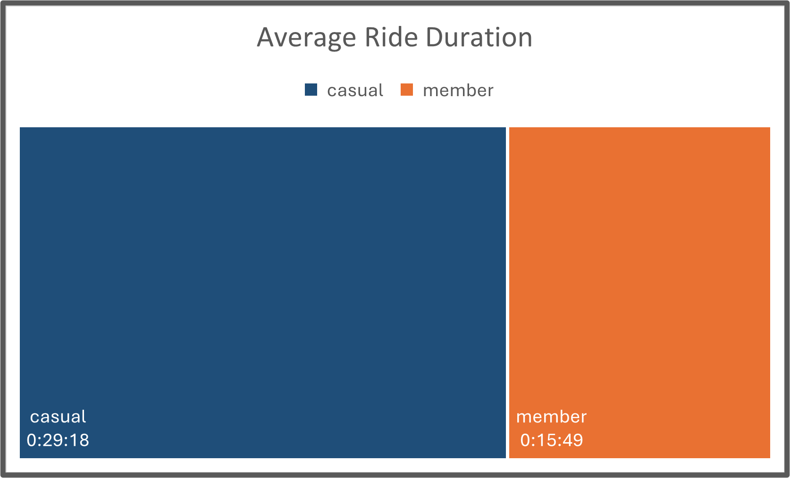
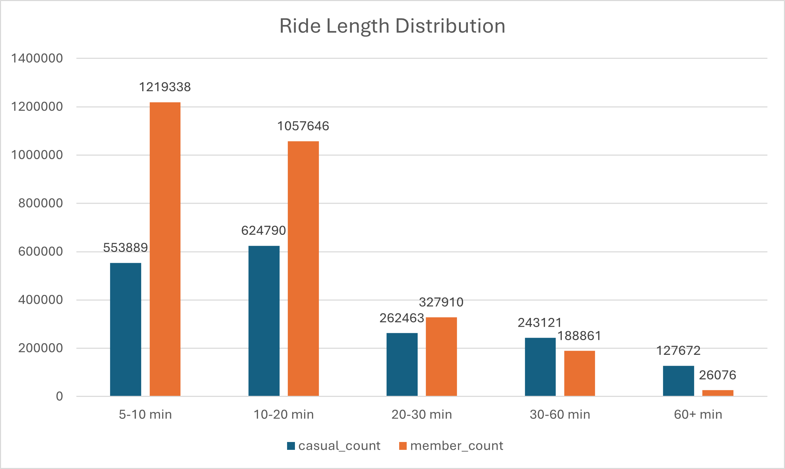
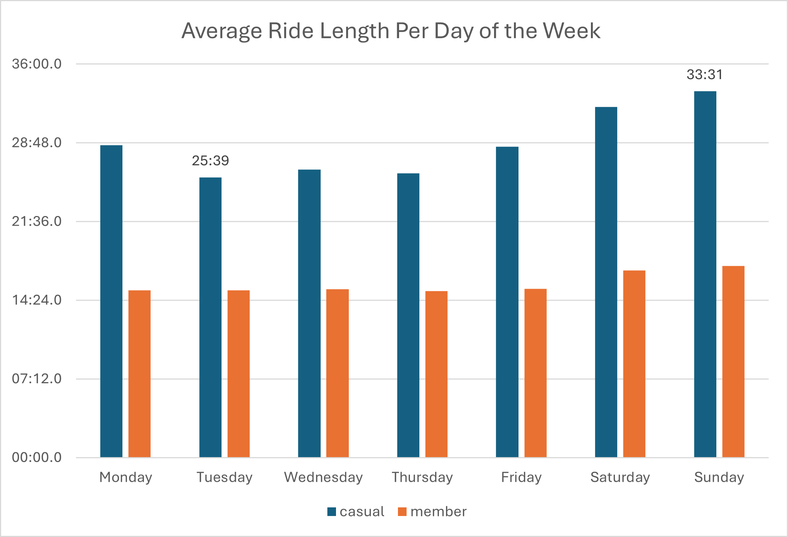

# 🚲 Unlocking Member Growth: Cyclistic Bike Share User Analysis 🚲

# Introduction
### 📈 Business Task

Identify how casual riders and annual members use fictional bike share service Cyclistic differently. Recommend marketing strategies to convert casual riders into riders with annual memberships.
<br><br>

### 👩‍💼 Target Audience

The key stakeholders are:
- The Cyclistic Executive team
- The Director of Marketing
- The Marketing Analytics team
<br><br>

### 🚀 Why It Matters

Memberships are crucial for Cyclistic’s long-term revenue and user loyalty. By understanding the behaviors and habits of casual riders, we can tailor strategies to encourage more conversions.

---

# Data Overview
### 🪄 Dataset

12 months of 'Cyclistic' trip data (anonymised data from a Chicago ride share service for 2024).
<br><br>

### 📊 Platforms Used

1. Initial data clean = Excel
2. Process and analyze = SQL
3. Visualize and present findings = Excel & Tableau. 
<br><br>

### 🔎 Key Variables Used

- ride_id
- rideable_type (classic bike / electric bike / electric scooter)
- started_at, ended_at (date and time)
- start_station_name, end_station_name
- start_lat, start_lng, end_lat, end_lng (the exact coordinates)
- member_casual (the type of user)
- ride_length
- text_day_of_week
<br><br>

### 🧼 Data Cleaning

- Added calculated columns. 
- Fixed cell format issues. 
- Removed invalid records. 
- Moved records into the correct month's workbook. 
- Checked for duplicate entries. 
<br><br>

---

# Exploratory Analysis

Before honing in on member vs. casual rider comparisons, I explored general usage trends: 
- The busiest month for rides is September, but July has the longest total ride time.
- Sundays have the longest rides, while the most rides overall are taken at 6pm.
- Riders use electric bikes slightly more often, but spend longer on classic bike rides. 
- Only 3.3% of rides start and end at the same station — round trips are rare.
<br><br>

---

# In-Depth Analysis & Modeling

Once I better understood the data, I focused on the most impactful differences between casual users and members. The insights below shaped my targeted marketing recommendations. 

## 1. Timing Patterns – When Do Users Ride?

Members take around 61% of all rides, suggesting a strong base of frequent users who enjoy a low per-ride cost. But casual riders show distinct timing behaviors compared to members, which presents targeted marketing opportunities. 
<br><br>


### Seasonality

Casual riders peak heavily in summer, while members stay more consistent throughout the year. 

<p align="center">
  
</p>

*Marketing Action*: Offer a three-month summer pass or free membership trial to capture casual rider interest at its peak. 
<br><br>


### Day of Week

Casual rider usage surges on weekends; members are more consistent across the week.

<p align="center">
  
</p>

*Marketing Action*: Create a weekend-only membership tier for casual riders. 
<br><br>


### Time of Day

Members ride during peak commuting hours; casual riders increase throughout the day before dropping off after 6pm.

<p align="center">
  
</p>

*Marketing Action*: Shift marketing language and imagery toward how membership can save money on long rides and evening outings, not just commutes. 
<br><br>


### Example Query:

```sql 

-- Calculates the % of all monthly rides taken by casual users

SELECT
	DATE_TRUNC('month', t.started_at) AS ride_month,
	COUNT(CASE WHEN m.member_casual = 'casual' THEN m.ride_id END) AS casual_rides,
	COUNT(t.ride_id) AS total_rides,
	(COUNT(CASE WHEN m.member_casual = 'casual' THEN m.ride_id END) * 100.0) / COUNT(m.ride_id) AS casual_ride_percentage
FROM ride_time AS t
INNER JOIN ride_method AS m
	ON t.ride_id = m.ride_id
GROUP BY ride_month;

```

<br><br>


## 2. Ride Duration - How Long Do They Ride For?

Some variables show little difference in casual rider behavior. I expected casual average ride length to increase in summer alongside overall ride volume, but it doesn't fluctuate much seasonally. 

However, casual riders show clear differences from members in other areas — taking longer rides on average and significantly more 60+ minute trips.
<br><br>


### Ride Length - Average & Distribution

**Overall Ride Length**: Casual riders average almost twice the ride length of members. 

<p align="center">
  
</p>

**Distribution**: Casual riders take significantly more 60+ minute rides, while members dominate short trips under 20 minutes.

<p align="center">
  
</p>

These patterns suggest casual users are taking longer, potentially leisure-based rides, which may require more comfort and endurance support.

*Marketing Action*: Emphasize the comfort of Cyclistic bikes. Promote the use of electric bikes for energy-preservation on longer rides. 
<br><br>


### Day of Week

Casual riders fluctuate more in average ride duration than members, taking longer rides at the weekends and dipping between Tuesdays and Thursdays. Casual riders may be riding more often for leisure, social outings, or special events like festivals. 

<p align="center">
  
</p>

*Marketing Action*: Offer a ‘weekend explorer pass’ with flat-rate pricing for extended rides. Partner with local events to offer bike-sharing discounts. Promote scenic routes and popular trails in the area. 
<br><br>


### Example Query:

```sql 

-- Calculates the distribution of ride lengths, split by user type

SELECT
	m.member_casual,
	CASE
		WHEN EXTRACT(EPOCH FROM ride_length) / 60 < 10 THEN '5-10 min'
		WHEN EXTRACT(EPOCH FROM ride_length) / 60 < 20 THEN '10-20 min'
		WHEN EXTRACT(EPOCH FROM ride_length) / 60 < 30 THEN '20-30 min'
		WHEN EXTRACT(EPOCH FROM ride_length) / 60 < 60 THEN '30-60 min'
		ELSE '60+ min'
	END AS ride_length_bucket,
	COUNT(*) AS ride_count
FROM ride_method AS m
INNER JOIN ride_time AS t
	ON m.ride_id = t.ride_id
GROUP BY member_casual, ride_length_bucket;

```

<br><br>


## 3. Bike Type Preferences - What Do They Ride?

In some metrics, member and casual rider behavior is very similar. For example, I analysed bike type use by time of day using histograms. Both user types prefer classic bikes during the day and switch to electrics in the early morning and evening. 

While there’s no clear marketing opportunity to act on when rider behavior aligns, I did find differences between users' average ride length. 
<br><br>


### Average Ride Length

Casual riders spend over twice as long on classic bike rides compared to electric bikes or scooters - unlike members, whose ride times are similar across all three types.

<p align="center">
  
</p>

*Marketing Action*: When offering rewards for longer bike rides, feature only marketing images of classic bikes. This should increase relatability to casual riders. 
<br><br>


### Example Query:

```sql 

-- Calculates average ride length per bike type, split by user type

SELECT
	m.member_casual AS user_type,
	m.rideable_type,
	ROUND(AVG(EXTRACT(EPOCH FROM t.ride_length) / 60), 2) AS avg_ride_length_minutes
FROM ride_method AS m
INNER JOIN ride_time AS t
	ON m.ride_id = t.ride_id
GROUP BY m.member_casual, rideable_type;

```

<br><br>


