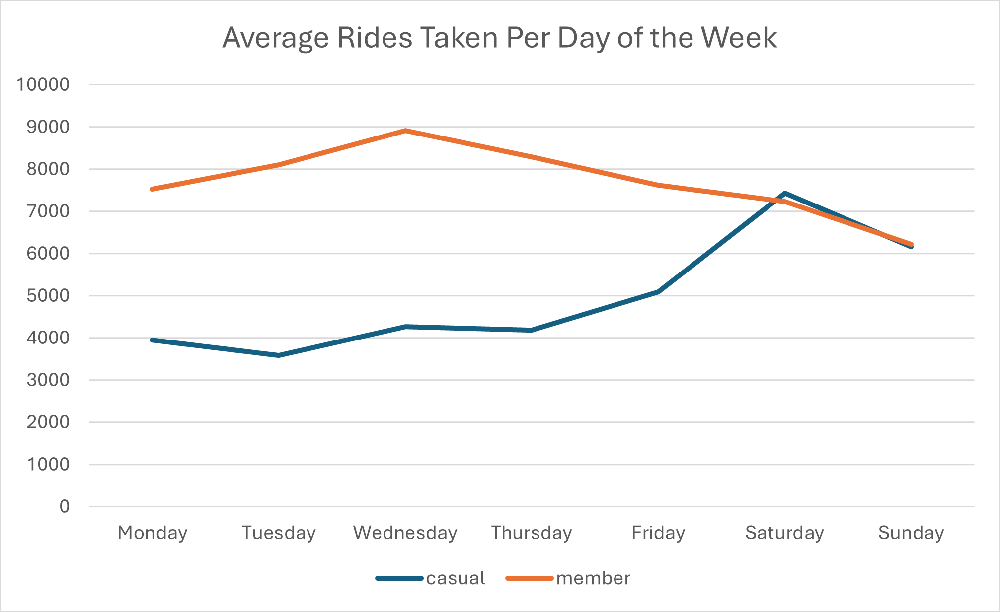

# 🚲 Unlocking Member Growth: Cyclistic Bike Share User Analysis 🚲

# Introduction
### 📈 Business Task

Identify how casual riders and annual members use fictional bike share service Cyclistic differently. Recommend marketing strategies to convert casual riders into riders with annual memberships.
<br><br>

### 👩‍💼 Target Audience

The key stakeholders are:
- The Cyclistic Executive team
- The Director of Marketing
- The Marketing Analytics team
<br><br>

### 🚀 Why It Matters

Memberships are crucial for Cyclistic’s long-term revenue and user loyalty. By understanding the behaviors and habits of casual riders, we can tailor strategies to encourage more conversions.

---

# Data Overview
### 🪄 Dataset

12 months of 'Cyclistic' trip data (anonymised data from a Chicago ride share service for 2024).
<br><br>

### 📊 Platforms Used

1. Initial data clean = Excel
2. Process and analyze = SQL
3. Visualize and present findings = Excel & Tableau. 
<br><br>

### 🔎 Key Variables Used

- ride_id
- rideable_type (classic bike / electric bike / electric scooter)
- started_at, ended_at (date and time)
- start_station_name, end_station_name
- start_lat, start_lng, end_lat, end_lng (the exact coordinates)
- member_casual (the type of user)
- ride_length
- text_day_of_week
<br><br>

### 🧼 Data Cleaning

- Added calculated columns. 
- Fixed cell format issues. 
- Removed invalid records. 
- Moved records into the correct month's workbook. 
- Checked for duplicate entries. 
<br><br>

### 🖼️ Presentation

Although my analysis of this dataset was extensive, I'll present here a summary of the findings I made that lead to useful marketing suggestions. 

---

# Exploratory Analysis

Before honing in on member vs. casual rider comparisons, I explored general usage trends: 
- The busiest month for rides is September, but July has the longest total ride time.
- Sundays have the longest rides, while the most rides overall are taken at 6pm.
- Riders use electric bikes slightly more often, but spend longer on classic bike rides. 
- Only 3.3% of rides start and end at the same station — round trips are rare.

---

# In-Depth Analysis & Modeling

Once I really understood my dataset, I analysed differences between casual users and members. I used the most relevant discoveries to formulate suggestions for marketing strategy. 

## 1. High-Level Usage Comparison

### Total rides: What percentage of total rides are by members vs. casual users? 

```sql 

-- This query counts, and calculates the percentage of, rides taken per type of user

SELECT
	member_casual AS type_of_user,
	COUNT(*),
	ROUND(COUNT(*) *100.0 / (SELECT COUNT (*) FROM ride_method), 2) AS percentage_of_total
FROM ride_method
GROUP BY type_of_user;

```


Members (61%) take more rides than casual users (39%). This suggests that the current membership deal offers enough value for frequent riders to commit to it. It also implies that members’ per-ride cost is much lower than casual users. 
- **Marketing Action**: Target casual users who ride frequently (e.g. 4+ times a month) and may not realize the savings they would make by switching. 

<br><br>

## 2. Timing Patterns (When Do They Ride?)

### Seasonality: Are there strong seasonal patterns in casual rider behavior that differ from members?

```sql 

-- This query calculates the percentage of total rides per month taken by casual users

SELECT
	DATE_TRUNC('month', t.started_at) AS ride_month,
	COUNT(CASE WHEN m.member_casual = 'casual' THEN m.ride_id END) AS casual_rides,
	COUNT(t.ride_id) AS total_rides,
	(COUNT(CASE WHEN m.member_casual = 'casual' THEN m.ride_id END) * 100.0) / COUNT(m.ride_id) AS casual_ride_percentage
FROM ride_time AS t
INNER JOIN ride_method AS m
	ON t.ride_id = m.ride_id
GROUP BY ride_month;

```


The total number of casual users’ rides increases during the summer months far more than members’ rides increases. If both user types' rides rose up and dropped off equally with the seasons, the percentage line would be 50% throughout. 
- **Marketing Action**: Offer a seasonal deal that targets casual riders whose usage increases in summer, e.g. a three-month summer pass, or a free membership trial advertised before and during summer to capture casual rider motivation at its peak. 

<br><br>

### Day of the week: Do casual riders favor weekends while members have a more consistent weekday pattern? 

```sql 

-- This query counts the rides taken on average each day of the week, split by type of user

SELECT
	t.text_day_of_week,
	m.member_casual,
	COUNT(t.ride_id) / COUNT(DISTINCT DATE(t.started_at)) AS avg_ride_count -- this part assumes a ride is taken every day of 2024 - but this is a reasonable assumption given the nature of the dataset.
FROM ride_time AS t
INNER JOIN ride_method AS m
	ON t.ride_id = m.ride_id
GROUP BY t.text_day_of_week,
	t.number_day_of_week,
	m.member_casual
ORDER BY m.member_casual,
	t.number_day_of_week;

```



Casual riders take fewer rides than members on weekdays. At weekends, the split is around 50/50 casual vs. member. This means casual users take more rides at the weekend.
- **Marketing Action**: Create a new weekend membership tier where members will pay less but only have free use of the bikes at weekends. 

<br><br>

### Time of day: Do casual users ride across the day while members ride during commuting hours? 

```sql 

-- This query counts rides taken each hour of the day, split by type of user

SELECT
	m.member_casual AS type_of_user,
	EXTRACT(HOUR FROM t.started_at) AS hour_of_day,
	COUNT(*) AS ride_count
FROM ride_time AS t
INNER JOIN ride_method AS m
	ON t.ride_id = m.ride_id
GROUP BY type_of_user, hour_of_day;

```


Casual riders’ rides increase throughout the day, peaking at 6pm before dropping off for the evening. As member rides peak significantly at 9am and 6pm, we could infer that they’re frequently using the bikes to commute. 
- **Marketing Action**: Casual riders might not convert because they see Cyclistic as a short-trip commuter service rather than a leisure-friendly option. Shift marketing language and advertising imagery to emphasize how membership can help save money on long rides and evening outings too. 

<br><br>

## 3. Ride Duration (How Long Do They Ride For?)

