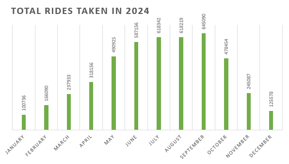

# 🚲 Unlocking Member Growth: Cyclistic Bike Share User Analysis 🚲

## Introduction
**📈 Business Task**

Identify how casual riders and annual members use fictional bike share service Cyclistic differently. Recommend marketing strategies to convert casual riders into riders with annual memberships.
<br><br>

**👩‍💼 Target Audience**

The key stakeholders are:
- The Cyclistic Executive team
- The Director of Marketing
- The Marketing Analytics team
<br><br>

**🚀 Why It Matters**

Memberships are crucial for Cyclistic’s long-term revenue and user loyalty. By understanding the behaviors and habits of casual riders, we can tailor strategies to encourage more conversions.

---

## Data Overview
**🪄 Dataset**

12 months of Cyclistic trip data (anonymised data from a Chicago ride share service for 2024).
<br><br>

**📊 Platforms Used**

1. Initial data clean = Excel
2. Process and analyze = SQL
3. Visualize and present findings = Excel & Tableau. 
<br><br>

**🔎 Key Variables Used**

- ride_id
- rideable_type (classic bike / electric bike / electric scooter)
- started_at, ended_at (date and time)
- start_station_name, end_station_name
- start_lat, start_lng, end_lat, end_lng (the exact coordinates)
- member_casual (the type of user)
- ride_length
- text_day_of_week
<br><br>

**🧼 Data Cleaning**

- Added calculated columns. 
- Fixed cell format issues. 
- Removed invalid records. 
- Moved records into the correct month's workbook. 
- Checked for duplicate entries. 

---

## Exploratory Analysis

### Users take the most rides in September

```sql 

-- This query counts the number of rides per month

SELECT 
	DATE_TRUNC('month', started_at) AS month,
	COUNT(*) AS number_of_rides
FROM ride_time
GROUP BY month
ORDER BY month; 

```




### Users spend the most time riding bikes in July

```sql 

-- This query calculates the total time spent on rides per month

SELECT
	DATE_TRUNC('month', started_at) AS month,
	SUM(ride_length) AS time_spent_on_rides
FROM ride_time
GROUP BY month;

```

<insert bar graph?>


### Users take the longest rides, on average, on Sundays

```sql 

-- This query calculates the average ride duration per day of the week

SELECT
	text_day_of_week AS day_of_week,
	AVG(ride_length) AS average_ride_duration
FROM ride_time
GROUP BY text_day_of_week,
	number_day_of_week
ORDER BY number_day_of_week;

```

<insert bar graph?>


### The most rides are taken at 6pm

```sql 

-- This query counts the rides taken each hour of the day

SELECT 
	EXTRACT(HOUR FROM started_at) AS hour_of_day,
	COUNT(*) AS ride_count
FROM ride_time
GROUP BY hour_of_day;

```


