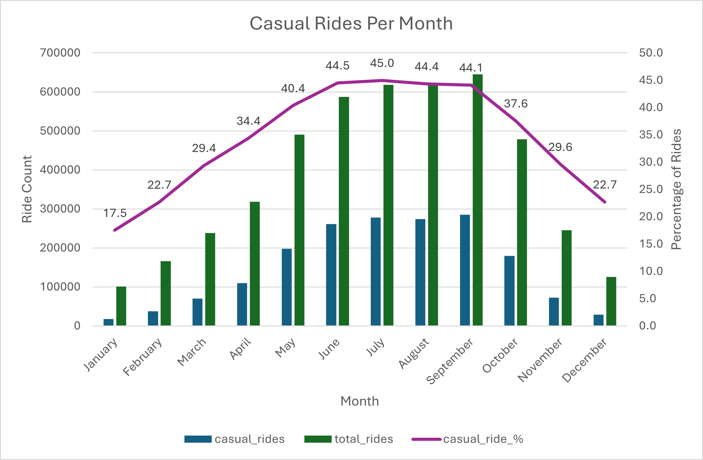
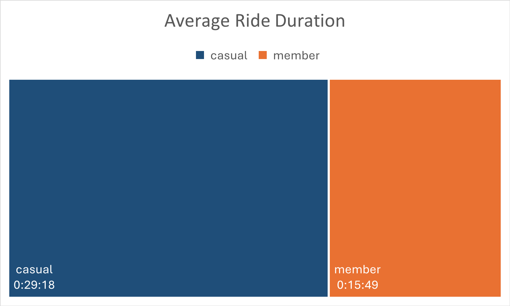
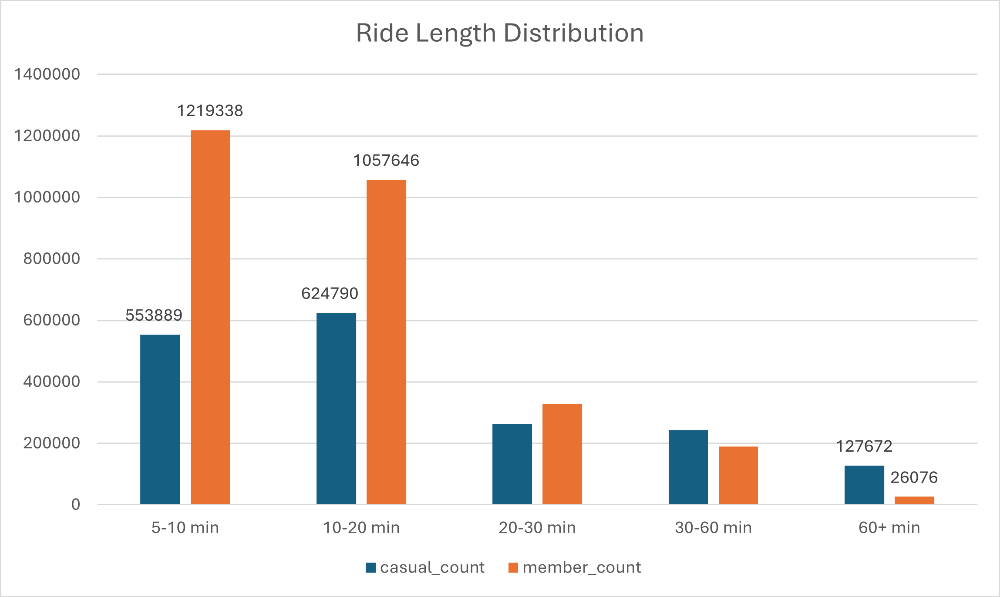
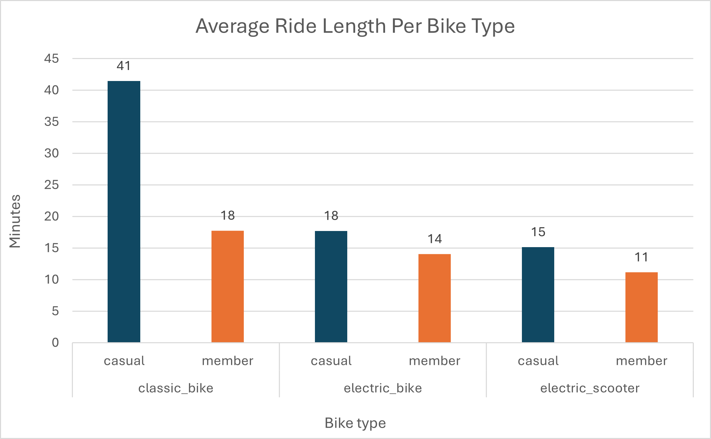
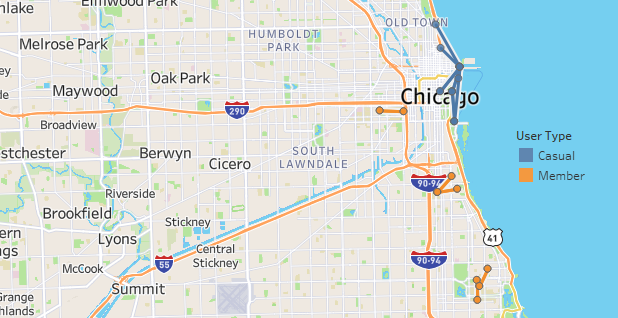
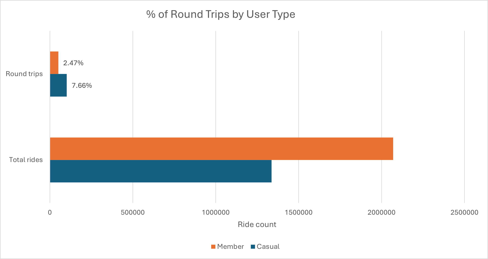

# 🚲 Unlocking Member Growth: Cyclistic Bike Share User Analysis 🚲

# Introduction
### 📈 Business Task

Identify how casual riders and annual members use fictional bike share service Cyclistic differently. Recommend marketing strategies to convert casual riders into riders with annual memberships.
<br><br>

### 👩‍💼 Target Audience

The key stakeholders are:
- The Cyclistic Executive team
- The Director of Marketing
- The Marketing Analytics team
<br><br>

### 🚀 Why It Matters

Memberships are crucial for Cyclistic’s long-term revenue and user loyalty. By understanding the behaviors and habits of casual riders, we can tailor strategies to encourage more conversions.

---

# Data Overview
### 🪄 Dataset

12 months of 'Cyclistic' trip data (anonymised data from a Chicago ride share service for 2024).
<br><br>

### 📊 Platforms Used

1. Initial data clean = Excel
2. Process and analyze = SQL
3. Visualize and present findings = Excel & Tableau. 
<br><br>

### 🔎 Key Variables Used

- ride_id
- rideable_type (classic bike / electric bike / electric scooter)
- started_at, ended_at (date and time)
- start_station_name, end_station_name
- start_lat, start_lng, end_lat, end_lng (the exact coordinates)
- member_casual (the type of user)
- ride_length
- text_day_of_week
<br><br>

### 🧼 Data Cleaning

- Added calculated columns
- Fixed cell format issues
- Removed invalid records
- Moved records into the correct month's workbook
- Checked for duplicate entries

After uploading the monthly CSVs into pgAdmin 4, I split the dataset into three relational tables — ride_method, ride_time, and ride_location — to improve query performance. I then used JOINs to access relevant fields throughout both the exploratory and in-depth analysis stages. 
<br><br>

---

# Exploratory Analysis

Before honing in on member vs. casual rider comparisons, I explored general usage trends: 
- The busiest month for rides is September, but July has the longest total ride time.
- Sundays have the longest rides, while the most rides overall are taken at 6pm.
- Riders use electric bikes slightly more often, but spend longer on classic bike rides. 
- Only 3.3% of rides start and end at the same station — round trips are rare.
<br><br>

---

# In-Depth Analysis & Modeling

Once I better understood the data, I focused on the most impactful differences between casual users and members. The insights below shaped my targeted marketing recommendations. 

## 1. Timing Patterns – When Do Users Ride?

Members take around 61% of all rides, suggesting a strong base of frequent users who enjoy a low per-ride cost. But casual riders show distinct timing behaviors compared to members, which presents targeted marketing opportunities. 
<br><br>


### Seasonality

Casual riders peak heavily in summer, while members stay more consistent throughout the year. 

<p align="center">
  
</p>

*Marketing Action*: Offer a three-month summer pass or free membership trial to capture casual rider interest at its peak. 
<br><br>


### Day of Week

Casual rider usage surges on weekends; members are more consistent across the week.

<p align="center">
  
</p>

*Marketing Action*: Create a weekend-only membership tier for casual riders. 
<br><br>


### Time of Day

Members ride during peak commuting hours; casual riders increase throughout the day before dropping off after 6pm.

<p align="center">
  
</p>

*Marketing Action*: Shift marketing language and imagery toward how membership can save money on long rides and evening outings, not just commutes. 
<br><br>


### Example Query:

```sql 

-- Calculates the % of all monthly rides taken by casual users

SELECT
	DATE_TRUNC('month', t.started_at) AS ride_month,
	COUNT(CASE WHEN m.member_casual = 'casual' THEN m.ride_id END) AS casual_rides,
	COUNT(t.ride_id) AS total_rides,
	(COUNT(CASE WHEN m.member_casual = 'casual' THEN m.ride_id END) * 100.0) / COUNT(m.ride_id) AS casual_ride_percentage -- this divides casual rides by total rides and presents as a percentage
FROM ride_time AS t
INNER JOIN ride_method AS m
	ON t.ride_id = m.ride_id
GROUP BY ride_month;

```

<br><br>


## 2. Ride Duration - How Long Do They Ride For?

Some variables show little difference in casual rider behavior. I expected casual average ride length to increase in summer alongside overall ride volume, but it doesn't fluctuate much seasonally. 

However, casual riders show clear differences from members in other areas — taking longer rides on average and significantly more 60+ minute trips.
<br><br>


### Ride Length - Average & Distribution

**Overall Ride Length**: Casual riders average almost twice the ride length of members. 

<p align="center">
  
</p>

**Distribution**: Casual riders take significantly more 60+ minute rides, while members dominate short trips under 20 minutes.

<p align="center">
  
</p>

These patterns suggest casual users are taking longer, potentially leisure-based rides, which may require more comfort and endurance support.

*Marketing Action*: Emphasize the comfort of Cyclistic bikes. Promote the use of electric bikes for energy-preservation on longer rides. 
<br><br>


### Day of Week

Casual riders fluctuate more in average ride duration than members, taking longer rides at the weekends and dipping between Tuesdays and Thursdays. Casual riders may be riding more often for leisure, social outings, or special events like festivals. 

<p align="center">
  
</p>

*Marketing Action*: Offer a ‘weekend explorer pass’ with flat-rate pricing for extended rides. Partner with local events to offer bike-sharing discounts. Promote scenic routes and popular trails in the area. 
<br><br>


### Example Query:

```sql 

-- Calculates the distribution of ride lengths, split by user type

SELECT
	m.member_casual, -- this field is the user type
	CASE
		WHEN EXTRACT(EPOCH FROM ride_length) / 60 < 10 THEN '5-10 min'
		WHEN EXTRACT(EPOCH FROM ride_length) / 60 < 20 THEN '10-20 min'
		WHEN EXTRACT(EPOCH FROM ride_length) / 60 < 30 THEN '20-30 min'
		WHEN EXTRACT(EPOCH FROM ride_length) / 60 < 60 THEN '30-60 min'
		ELSE '60+ min'
	END AS ride_length_bucket, -- I used these buckets for a histogram 
	COUNT(*) AS ride_count
FROM ride_method AS m
INNER JOIN ride_time AS t
	ON m.ride_id = t.ride_id
GROUP BY member_casual, ride_length_bucket;

```

<br><br>


## 3. Bike Type Preferences - What Do They Ride?

I found differences between users' average ride length on different bike types. However, in all other metrics I studied, member and casual rider behavior is very similar so there's no marketing opportunity. 

For example, I created histograms to analyse bike type use by time of day. Both user types prefer classic bikes during the day and switch to electrics in the early morning and evening. 
<br><br>


### Average Ride Length

Casual riders spend over twice as long on classic bike rides compared to electric bikes or scooters - unlike members, whose ride times are similar across all three types.

<p align="center">
  
</p>

*Marketing Action*: When offering rewards for longer bike rides, feature only marketing images of classic bikes. This should increase relatability to casual riders. 
<br><br>


### Example Query:

```sql 

-- Calculates average ride length per bike type, split by user type

SELECT
	m.member_casual AS user_type,
	m.rideable_type,
	ROUND(AVG(EXTRACT(EPOCH FROM t.ride_length) / 60), 2) AS avg_ride_length_minutes -- ride_length was in H:MM:SS format so I converted to minutes
FROM ride_method AS m
INNER JOIN ride_time AS t
	ON m.ride_id = t.ride_id
GROUP BY m.member_casual, rideable_type;

```

<br><br>


## 4. Station Popularity & Routes - Where Do They Ride?

I found stark differences between casual riders and members when looking at their: 
- most popular start stations
- most popular end stations
- most popular A-to-B routes
- percentage of rides that are round trips.

This provided great opportunities to hone in on relevant casual user marketing strategies. 
<br><br>


### Most Popular A-to-B Routes

There are no shared top 10 station-to-station trip routes between casual riders and members. When viewed on a map of Chicago, the routes don't inhabit the same areas either. 

Casual riders ride the most in the Lakefront Trail/tourist zone of Chicago, which supports the theory that they're leisure- or sightseeing-focused. 

<p align="center">
	**Map of 10 Most Popular Routes Per User Type**
</p>
<p align="center">
  
</p>

*Marketing Action*: Promote annual membership by including partnership discounts at cafes, museums or park events near riders' most popular stations. 
<br><br>


### Round Trip Percentage

Overall, members take more round trips in absolute numbers. But as a percentage of their total rides, casual users are over three times more likely to make a round trip than members. 

Although the percentages are low, this further indicates that casual riders use bikes for leisure or exploration, rather than commuting from point A to point B.

<p align="center">
  
</p>

*Marketing Action*: Add in-app challenges to ride specific loops from popular stations for casual riders. 
<br><br>


### Example Query:

```sql 

-- Calculates the top 10 most common A-to-B routes for each user type

(
SELECT m.member_casual AS user_type,
	l.start_station_name,
	l.end_station_name,
	COUNT(*) AS trip_count
FROM ride_location AS l
INNER JOIN ride_method AS m
	ON l.ride_id = m.ride_id
WHERE start_station_name IS NOT NULL
	AND end_station_name IS NOT NULL
	AND start_station_name != end_station_name -- this excludes round trips
	AND member_casual = 'casual'
GROUP BY m.member_casual, l.start_station_name, l.end_station_name
ORDER BY trip_count DESC
LIMIT 10
)

UNION ALL -- I used to combine casual and member users in the same query, allowing direct comparison

(
SELECT m.member_casual AS user_type,
	l.start_station_name,
	l.end_station_name,
	COUNT(*) AS trip_count
FROM ride_location AS l
INNER JOIN ride_method AS m
	ON l.ride_id = m.ride_id
WHERE start_station_name IS NOT NULL
	AND end_station_name IS NOT NULL
	AND start_station_name != end_station_name
	AND member_casual = 'member'
GROUP BY m.member_casual, l.start_station_name, l.end_station_name
ORDER BY trip_count DESC
LIMIT 10
);

```
<br><br>

---

# Top 3 Marketing Recommendations

### 🚲 1. Launch a Summer Trial Membership

Casual rider volume peaks in summer. Offer a three-month summer pass or free trial during this window to hook riders when usage is highest.

### 🚲 2. Introduce a Weekend-Only Membership Tier

Casual riders spike on weekends and take longer, leisure-focused rides. A discounted weekend membership can convert occasional users into repeat members.

### 🚲 3. Promote Scenic Ride Perks & Loop Challenges

Casual riders favor longer, round-trip rides in scenic areas. Encourage conversion by:
- Adding loop-based in-app challenges
- Offering partner discounts at attractions near high-traffic stations.
<br><br>

These recommendations target the specific behaviors that differentiate casual riders from members. They use observed usage data on timing, location, and ride patterns to identify high-conversion opportunities.

<br><br>
